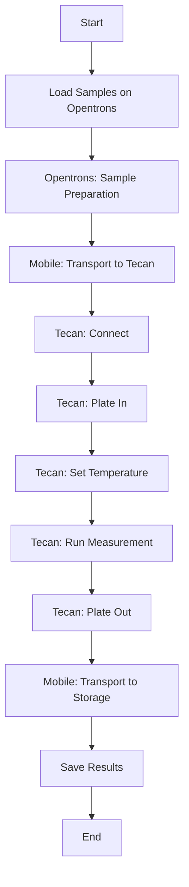
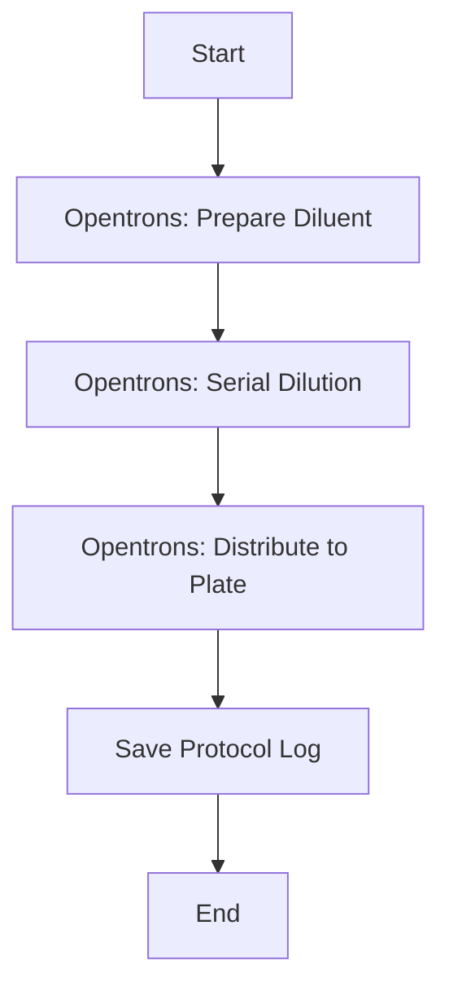

# 🏗️ Panoramica Architetturale - BicoccaLab v6

> Visione d'insieme dell'architettura del sistema di automazione di laboratorio

## 📋 Sommario

Questo documento fornisce una panoramica completa dell'architettura del sistema BicoccaLab v6, un sistema di automazione di laboratorio integrato basato sul protocollo SiLA2.

---

## 🎯 Obiettivi del Sistema

1. **Automazione End-to-End**: Dall'elaborazione campioni all'analisi
2. **Interoperabilità**: Standard SiLA2 per comunicazione tra dispositivi
3. **Estensibilità**: Facile aggiunta di nuovi strumenti
4. **Tracciabilità**: Logging completo di tutte le operazioni
5. **Robustezza**: Recovery da errori e crash

---

## 🏭 Componenti Hardware

### Strumenti del Laboratorio

```
┌─────────────────────────────────────────────────────────────────────────────┐
│                           LABORATORIO BICOCCALAB                             │
├─────────────────────────────────────────────────────────────────────────────┤
│                                                                              │
│    ┌───────────────────┐      ┌───────────────────┐      ┌───────────────┐ │
│    │                   │      │                   │      │               │ │
│    │   OPENTRONS FLEX  │      │  TECAN M200 PRO   │      │    STORAGE    │ │
│    │                   │      │                   │      │               │ │
│    │   Liquid Handler  │      │   Plate Reader    │      │  Plate Racks  │ │
│    │   8/96 channel    │      │   ABS/FI/LUM      │      │               │ │
│    │   1-1000µL        │      │   96/384 well     │      │               │ │
│    │                   │      │                   │      │               │ │
│    └─────────┬─────────┘      └─────────┬─────────┘      └───────┬───────┘ │
│              │                          │                        │         │
│              │                          │                        │         │
│              └──────────────┬───────────┴────────────────────────┘         │
│                             │                                               │
│                             ▼                                               │
│                   ┌───────────────────┐                                    │
│                   │                   │                                    │
│                   │     GOFAGO        │                                    │
│                   │  Mobile Robot     │                                    │
│                   │                   │                                    │
│                   │  RB Kairos Base   │                                    │
│                   │  + ABB GoFa Arm   │                                    │
│                   │                   │                                    │
│                   └───────────────────┘                                    │
│                                                                              │
└─────────────────────────────────────────────────────────────────────────────┘
```

### Specifiche Hardware

| Strumento | Modello | Funzione | Connessione |
|-----------|---------|----------|-------------|
| **Liquid Handler** | Opentrons Flex | Pipettaggio, mixing, trasferimento | Ethernet (REST API) |
| **Plate Reader** | Tecan M200 Pro | ABS, FI, LUM | USB (iControl SDK) |
| **Mobile Robot** | GoFaGo | Trasporto labware | **WiFi** (ROS1 Services) |
| **Moduli Opentrons** | Vari | Temperatura, PCR, magneti | Via Opentrons |

---

## 🔌 Architettura Software

### Stack Tecnologico

```
┌─────────────────────────────────────────────────────────────────────────────┐
│                              PRESENTATION LAYER                              │
│                                                                              │
│   ┌─────────────────┐  ┌─────────────────┐  ┌─────────────────────────────┐│
│   │   CLI Console   │  │  Node-RED UI    │  │    External Clients         ││
│   │                 │  │  (Future)       │  │    (Python, C#, etc.)       ││
│   └────────┬────────┘  └────────┬────────┘  └─────────────┬───────────────┘│
│            │                    │                         │                 │
└────────────┼────────────────────┼─────────────────────────┼─────────────────┘
             │                    │                         │
             ▼                    ▼                         ▼
┌─────────────────────────────────────────────────────────────────────────────┐
│                            ORCHESTRATION LAYER                               │
│                                                                              │
│   ┌─────────────────────────────────────────────────────────────────────┐  │
│   │                         ORCHESTRATOR                                 │  │
│   │                                                                      │  │
│   │  ┌─────────────┐  ┌─────────────┐  ┌─────────────┐  ┌───────────┐  │  │
│   │  │   Gateway   │  │  Workflow   │  │   Device    │  │   MQTT    │  │  │
│   │  │  Discovery  │  │  Executor   │  │  Manager    │  │  Bridge   │  │  │
│   │  └─────────────┘  └─────────────┘  └─────────────┘  └───────────┘  │  │
│   │                                                                      │  │
│   └─────────────────────────────────────────────────────────────────────┘  │
│                                                                              │
└──────────────────────────────────┬───────────────────────────────────────────┘
                                   │ gRPC (SiLA2)
                                   │
┌──────────────────────────────────┼───────────────────────────────────────────┐
│                           SERVICE LAYER (SiLA2 Servers)                      │
│                                  │                                           │
│    ┌─────────────────┬───────────┼───────────┬─────────────────┐            │
│    │                 │           │           │                 │            │
│    ▼                 ▼           ▼           ▼                 ▼            │
│ ┌──────────┐   ┌──────────┐ ┌──────────┐ ┌──────────┐   ┌──────────┐       │
│ │  Tecan   │   │ Opentrons│ │  Mobile  │ │ Future   │   │ Future   │       │
│ │  Server  │   │  Server  │ │  Server  │ │ Device 1 │   │ Device N │       │
│ │  C#/.NET │   │  Python  │ │  Python  │ │          │   │          │       │
│ │  :50051  │   │  :50052  │ │  :50053  │ │  :50054  │   │  :5005X  │       │
│ └────┬─────┘   └────┬─────┘ └────┬─────┘ └──────────┘   └──────────┘       │
│      │              │            │                                          │
└──────┼──────────────┼────────────┼──────────────────────────────────────────┘
       │              │            │
┌──────┼──────────────┼────────────┼──────────────────────────────────────────┐
│      │   HARDWARE ABSTRACTION LAYER                                         │
│      │              │            │                                           │
│      ▼              ▼            ▼                                           │
│ ┌──────────┐   ┌──────────┐ ┌──────────┐                                    │
│ │  Tecan   │   │ Opentrons│ │   ROS1   │                                    │
│ │ iControl │   │  HTTP    │ │  Bridge  │                                    │
│ │   SDK    │   │   API    │ │          │                                    │
│ └────┬─────┘   └────┬─────┘ └────┬─────┘                                    │
│      │              │            │                                           │
└──────┼──────────────┼────────────┼──────────────────────────────────────────┘
       │              │            │
       ▼              ▼            ▼
┌─────────────────────────────────────────────────────────────────────────────┐
│                            PHYSICAL DEVICES                                  │
│                                                                              │
│   ┌───────────┐      ┌───────────┐      ┌───────────┐                      │
│   │ Tecan     │      │ Opentrons │      │  GoFaGo   │                      │
│   │ M200 Pro  │      │   Flex    │      │  Mobile   │                      │
│   │ (USB)     │      │ (Ethernet)│      │  (ROS)    │                      │
│   └───────────┘      └───────────┘      └───────────┘                      │
│                                                                              │
└─────────────────────────────────────────────────────────────────────────────┘
```

---

## 📡 Protocollo SiLA2

### Struttura Feature SiLA2

```
┌─────────────────────────────────────────────────────────────────┐
│                     SiLA2 FEATURE                                │
├─────────────────────────────────────────────────────────────────┤
│                                                                  │
│  Feature: PlateReaderService                                     │
│  Category: instrument                                            │
│  Originator: BicoccaLab                                          │
│  Version: 1.0.0                                                  │
│                                                                  │
│  ┌────────────────────────────────────────────────────────────┐ │
│  │  COMMANDS                                                   │ │
│  │                                                             │ │
│  │  • Connect(connectionString) → success                     │ │
│  │  • Disconnect() → success                                  │ │
│  │  • PlateIn() → success                                     │ │
│  │  • PlateOut() → success                                    │ │
│  │  • SetTemperature(target) → success                        │ │
│  │  • RunMeasurement(protocol, plateId) → stream[progress]    │ │
│  │  • GetResults(format) → data                               │ │
│  │                                                             │ │
│  └────────────────────────────────────────────────────────────┘ │
│                                                                  │
│  ┌────────────────────────────────────────────────────────────┐ │
│  │  PROPERTIES                                                 │ │
│  │                                                             │ │
│  │  • IsConnected: Boolean (Observable)                       │ │
│  │  • OperationalStatus: String (Observable)                  │ │
│  │  • CurrentTemperature: Real (Observable)                   │ │
│  │  • InstrumentInfo: Struct (Non-Observable)                 │ │
│  │                                                             │ │
│  └────────────────────────────────────────────────────────────┘ │
│                                                                  │
└─────────────────────────────────────────────────────────────────┘
```

### Comunicazione gRPC

```
┌─────────────┐                              ┌─────────────┐
│   Client    │                              │   Server    │
│(Orchestrator)│                              │ (SiLA2)     │
└──────┬──────┘                              └──────┬──────┘
       │                                            │
       │  1. Unary RPC                              │
       │──────────────────────────────────────────▶│
       │  Request: ConnectRequest                   │
       │                                            │
       │◀──────────────────────────────────────────│
       │  Response: ConnectResponse                 │
       │                                            │
       │  2. Server Streaming RPC                   │
       │──────────────────────────────────────────▶│
       │  Request: RunMeasurementRequest            │
       │                                            │
       │◀ ─ ─ ─ ─ ─ ─ ─ ─ ─ ─ ─ ─ ─ ─ ─ ─ ─ ─ ─ ─│
       │  Stream: Progress 10%                      │
       │◀ ─ ─ ─ ─ ─ ─ ─ ─ ─ ─ ─ ─ ─ ─ ─ ─ ─ ─ ─ ─│
       │  Stream: Progress 50%                      │
       │◀ ─ ─ ─ ─ ─ ─ ─ ─ ─ ─ ─ ─ ─ ─ ─ ─ ─ ─ ─ ─│
       │  Stream: Progress 100%                     │
       │◀──────────────────────────────────────────│
       │  Final: Complete                           │
       │                                            │
```

---

## 📂 Struttura Directory

```
BicoccaLab_v6/
├── 📁 docs/                      # Documentazione
│   ├── 📁 SystemDocs/            # Documentazione sistema (NUOVA)
│   │   ├── README.md
│   │   ├── TECAN_SERVER.md
│   │   ├── OPENTRONS_SERVER.md
│   │   ├── MOBILE_SERVER.md
│   │   ├── ORCHESTRATOR.md
│   │   ├── NODERED_MIGRATION.md
│   │   └── ARCHITECTURE_OVERVIEW.md
│   ├── ARCHITECTURE.md
│   ├── GUIDA_RICETTE_OPENTRONS_HAL.md
│   ├── PROTOCOLS.md
│   └── QUICKSTART.md
│
├── 📁 Library/                   # Libreria configurazioni
│   ├── 📁 Analysis/              # Protocolli Tecan (.mdfx)
│   ├── 📁 HardwareConfig/        # Configurazioni HAL
│   ├── 📁 Recipes/               # Ricette Opentrons (JSON)
│   ├── 📁 Workflows/             # Workflow multi-device (JSON)
│   └── 📁 Protocols/             # Protocolli validati
│
├── 📁 Queue/                     # Coda elaborazione
│   └── 📁 pending_workflows/     # Workflow in attesa
│
├── 📁 Results/                   # Output risultati
│   ├── 📁 AnIML/                 # Formato AnIML
│   ├── 📁 CSV/                   # Formato CSV
│   ├── 📁 XML/                   # Formato XML
│   └── 📁 opentrons/             # Log Opentrons
│
├── 📁 SiLA2/                   # Server SiLA2
│   ├── 📁 TecanSiLA2Server/      # Server Tecan (C#)
│   ├── 📁 OpentronsSiLA2Server/  # Server Opentrons (Python)
│   ├── 📁 MobileSiLA2Server/     # Server Mobile (Python)
│   └── 📁 Orchestrator/          # Orchestratore (Python)
│
├── 📄 start_lab.bat              # Script avvio Windows
├── 📄 Start-Lab.ps1              # Script avvio PowerShell
├── 📄 start_orchestrator.py      # Avvio orchestrator
├── 📄 start_opentrons.py         # Avvio server Opentrons
├── 📄 start_mobile.py            # Avvio server Mobile
└── 📄 lab_console.py             # Console interattiva
```

---

## 🔄 Flussi di Lavoro Tipici

### Flusso 1: ELISA Completo



### Flusso 2: Serial Dilution



---

## 🔐 Sicurezza

### Considerazioni di Sicurezza

| Area | Misura | Status |
|------|--------|--------|
| **Rete** | Firewall per porte gRPC | ✅ Implementato |
| **Autenticazione** | Basic Auth su Node-RED | 🔄 Pianificato |
| **Crittografia** | TLS per gRPC | 📋 Futuro |
| **Logging** | Audit log operazioni | ✅ Implementato |
| **Backup** | Backup configurazioni | ✅ Implementato |

### Porte di Rete

| Porta | Servizio | Protocollo | Note |
|-------|----------|------------|------|
| 50051 | Tecan SiLA2 | gRPC | Locale |
| 50052 | Opentrons SiLA2 | gRPC | Locale |
| 50053 | Mobile SiLA2 | gRPC | Locale |
| 31950 | Opentrons Robot | HTTP REST | Ethernet |
| 1880 | Node-RED (futuro) | HTTP | Locale |
| 11311 | ROS1 Master | TCP | **WiFi** (sul robot) |

---

## 📊 Monitoraggio

### Metriche Chiave

```
┌────────────────────────────────────────────────────────────────┐
│                    SYSTEM HEALTH DASHBOARD                      │
├────────────────────────────────────────────────────────────────┤
│                                                                 │
│  DEVICES                           OPERATIONS TODAY            │
│  ────────                          ────────────────            │
│  🟢 Tecan: Connected               Workflows:     12           │
│  🟢 Opentrons: Connected           Measurements:  48           │
│  🟢 Mobile: Connected              Transports:    24           │
│  🟢 Orchestrator: Running          Errors:         2           │
│                                                                 │
│  QUEUED WORKFLOWS                  RECENT ACTIVITY             │
│  ────────────────                  ───────────────             │
│  • ELISA_Batch_1.json              10:30 Workflow completed    │
│  • QC_Daily.json                   10:15 Measurement done      │
│                                    09:45 Transport complete    │
│                                                                 │
└────────────────────────────────────────────────────────────────┘
```

---

## 🚀 Performance

### Benchmark Operazioni

| Operazione | Tempo Medio | Variabilità |
|------------|-------------|-------------|
| Connessione Tecan | 2-5 sec | ±1 sec |
| PlateIn/Out | 10-15 sec | ±2 sec |
| Lettura 96 well ABS | 30-60 sec | ±10 sec |
| Upload protocollo Opentrons | 5-10 sec | ±3 sec |
| Esecuzione pipettaggio | Dipende | - |
| Trasporto mobile | 60-120 sec | ±30 sec |

---

## 🔮 Roadmap Futura

### Q1 2025
- [ ] Migrazione a Node-RED Dashboard
- [ ] Nodi SiLA2 custom per Node-RED
- [ ] Dashboard real-time

### Q2 2025
- [ ] Integrazione LIMS
- [ ] Autenticazione avanzata
- [ ] Mobile app per monitoraggio

### Q3 2025
- [ ] AI/ML per ottimizzazione protocolli
- [ ] Predictive maintenance
- [ ] Multi-lab orchestration

---

## 📚 Riferimenti

- [SiLA2 Standard](https://sila-standard.com/)
- [Opentrons API](https://docs.opentrons.com/)
- [Tecan iControl](https://lifesciences.tecan.com/)
- [ROS1 Documentation](http://wiki.ros.org/)
- [gRPC Documentation](https://grpc.io/)
- [Node-RED](https://nodered.org/)

---

*Documentazione Architettura - BicoccaLab v6*
