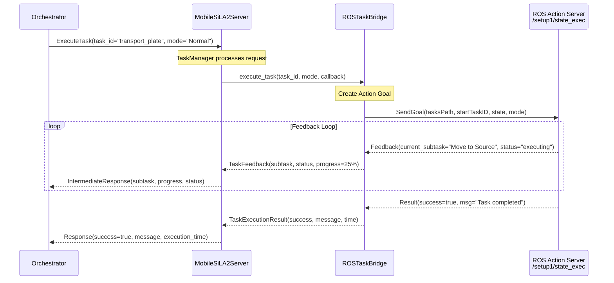

# 🚗 MobileSiLA2Server - Documentazione Dettagliata

> Server SiLA2 per il controllo del robot mobile GoFaGo (RB Kairos + ABB GoFa)

## 📋 Informazioni Generali

| Proprietà | Valore |
|-----------|--------|
| **Linguaggio** | Python 3.10+ |
| **Protocollo** | SiLA2 (gRPC) |
| **Porta Default** | 50053 |
| **Robot Base** | Robotnik RB Kairos |
| **Braccio Robot** | ABB GoFa CRB 15000 |
| **Middleware** | ROS1 (Noetic) |
| **Connessione** | WiFi (via Router) |
| **Architettura** | Task-based (High-Level) |

## 🆕 Nota sulla Nuova Architettura

Questa versione del server implementa un'architettura **Task-Based** ad alto livello. Invece di controllare direttamente navigazione, braccio e gripper, il server comunica con un **action server ROS** sul PC robot che espone task predefiniti.

### Differenze rispetto alla versione precedente

| Aspetto | Versione Precedente | Versione Attuale |
|---------|---------------------|------------------|
| **Granularità** | Controllo low-level (move_base, MoveIt) | Task high-level predefiniti |
| **Feature SiLA2** | MobileRobot + Logistics | TaskManagement |
| **ROS Interface** | Topic/Service diretti | Action Server + Service |
| **Definizione Task** | Nel server | Sul PC robot |
| **Feedback** | Stato singole operazioni | Subtask corrente + progress |

---

## 🏗️ Architettura del Sistema

### Connessione di Rete

Il robot mobile GoFaGo comunica con l'orchestratore attraverso la **WiFi hotspot** del Robot PC. Questo approccio permette connessione diretta senza dipendere da infrastruttura di rete esterna.

```
┌─────────────────────────────────────────────────────────────────────────┐
│                    ARCHITETTURA DI RETE (Hotspot Mode)                   │
├─────────────────────────────────────────────────────────────────────────┤
│                                                                          │
│   ┌─────────────────┐         WiFi           ┌─────────────────────────┐│
│   │  Orchestrator   │◄─────────────────────►│      Robot PC           ││
│   │  (Windows)      │    (Hotspot Client)    │      (Ubuntu)           ││
│   │                 │                        │   ┌─────────────────┐   ││
│   │  - LabOS        │   IP: 10.16.0.114     │   │ Hotspot (AP)    │   ││
│   │  - WebApp       │◄─────────────────────►│   │ "RobotHotspot"  │   ││
│   │  - SiLA2 Client │    Port: 50053        │   └─────────────────┘   ││
│   └─────────────────┘                        │                         ││
│                                              │   ┌─────────────────┐   ││
│                                              │   │ MobileSiLA2     │   ││
│                                              │   │ Server          │   ││
│                                              │   │ (this server)   │   ││
│                                              │   └─────────────────┘   ││
│                                              │          │              ││
│                                              │     ROS  │              ││
│                                              │          ▼              ││
│                                              │   ┌─────────────────┐   ││
│                                              │   │ ROS Task Exec   │   ││
│                                              │   │ Action Server   │   ││
│                                              │   └─────────────────┘   ││
│                                              │          │ Ethernet     ││
│                                              │          ▼              ││
│                                              │   ┌─────────────────┐   ││
│                                              │   │    GoFaGo       │   ││
│                                              │   │  Mobile Robot   │   ││
│                                              │   └─────────────────┘   ││
│                                              └─────────────────────────┘│
└─────────────────────────────────────────────────────────────────────────┘
```

#### Configurazione in lab_config.yaml (su Windows Orchestrator)

```yaml
servers:
  mobile:
    name: Mobile Robot
    enabled: true
    host: 10.16.0.114    # Robot PC hotspot gateway IP
    port: 50053
    remote: true
    network:
      hotspot_ssid: "RobotHotspot"
      connection_timeout: 5.0
```

#### Setup della connessione

1. **Robot PC**: Avvia l'hotspot WiFi (SSID: RobotHotspot)
2. **Robot PC**: Avvia MobileSiLA2Server (`./run_server.sh`)
3. **Orchestrator PC**: Connettiti alla WiFi "RobotHotspot"
4. **Orchestrator PC**: Verifica connessione da Settings → Network → Test Connection

### Architettura Software (Task-Based)

Il software utilizza un'**architettura task-based**. Il server SiLA2 comunica con un action server ROS sul PC robot che espone task predefiniti.

```
┌─────────────────────────────────────────────────────────────────────────┐
│                       MobileSiLA2Server                                  │
├─────────────────────────────────────────────────────────────────────────┤
│                                                                          │
│  ┌──────────────┐     ┌───────────────────────────────────────────────┐ │
│  │   main.py    │────▶│           gRPC Async Server                   │ │
│  │  (Entrypoint)│     │   - TaskManagement Feature (high-level)       │ │
│  └──────────────┘     └───────────────────────────────────────────────┘ │
│                                        │                                 │
│                                        ▼                                 │
│  ┌───────────────────────────────────────────────────────────────────┐  │
│  │                      TaskManager                                   │  │
│  │   - Task discovery (from robot)                                    │  │
│  │   - Task execution (via ROS action)                                │  │
│  │   - Progress feedback                                              │  │
│  │   - Task cancellation                                              │  │
│  └───────────────────────────────────────────────────────────────────┘  │
│           │                              │                               │
│           │ (Simulation Mode)            │ (Production Mode)             │
│           ▼                              ▼                               │
│  ┌─────────────────┐            ┌─────────────────────────┐             │
│  │   Simulator     │            │     ROSTaskBridge       │             │
│  │                 │            │                         │             │
│  │  - Fake tasks   │            │  - Action client        │             │
│  │  - Test logic   │            │    /setup1/state_exec   │             │
│  └─────────────────┘            │  - Service proxy        │             │
│                                 │    /setup1/getSubtasksInfo│            │
│                                 └─────────────────────────┘             │
│                                            │ WiFi                        │
└────────────────────────────────────────────│─────────────────────────────┘
                                             │
                                             ▼
┌─────────────────────────────────────────────────────────────────────────┐
│                    ROBOT PC (ROS1)                                       │
├─────────────────────────────────────────────────────────────────────────┤
│                                                                          │
│   ┌─────────────────────────────────────────────────────────────────┐   │
│   │                    Task Execution System                         │   │
│   │                                                                  │   │
│   │   Action Server: /setup1/state_exec                              │   │
│   │   - Receives: tasksPath, startTaskID, endTaskID, state, mode     │   │
│   │   - Returns: success, msg                                        │   │
│   │   - Feedback: current_subtask, status                            │   │
│   │                                                                  │   │
│   │   Service: /setup1/getSubtasksInfo                               │   │
│   │   - Returns: tasksInfo[], result, info                           │   │
│   └─────────────────────────────────────────────────────────────────┘   │
│                                   │                                      │
│                                   ▼                                      │
│   ┌─────────────┐  ┌─────────────┐  ┌─────────────┐  ┌─────────────┐   │
│   │  roscore    │  │ Navigation  │  │   Arm       │  │  Gripper    │   │
│   │  (Master)   │  │  Stack      │  │  Control    │  │  Control    │   │
│   └─────────────┘  └─────────────┘  └─────────────┘  └─────────────┘   │
│                                                                          │
├─────────────────────────────────────────────────────────────────────────┤
│                           HARDWARE LAYER                                 │
│                                                                          │
│   ┌─────────────────────────────┐    ┌─────────────────────────────┐   │
│   │      RB Kairos Base         │    │       ABB GoFa Arm          │   │
│   │   - Wheels & Motors         │    │   - 6-DOF Manipulator       │   │
│   │   - LIDAR Sensors           │    │   - Gripper                 │   │
│   │   - IMU & Odometry          │    │   - Force/Torque Sensor     │   │
│   └─────────────────────────────┘    └─────────────────────────────┘   │
│                                                                          │
└─────────────────────────────────────────────────────────────────────────┘
```

---

## 📁 Struttura File

```
MobileSiLA2Server/
├── main.py              # Entry point e server principale
├── ros_task_bridge.py   # Bridge per comunicazione task-based con ROS
├── config.yaml          # Configurazione server
├── features/
│   └── TaskManagement.sila.xml  # Definizione feature SiLA2
└── __pycache__/
```

---

## 🔌 Interfaccia ROS

### Action Server: `/setup1/state_exec`

Il robot PC espone un action server per l'esecuzione di task.

**Action Definition (executionCommand.action):**
```yaml
# Request
string tasksPath        # Path dei file task sul robot PC
string startTaskID      # ID del task root da eseguire
string endTaskID        # ID dell'ultimo subtask (opzionale)
int16 state             # Stato esecuzione (0=IDLE, 1=RUNNING, 2=PAUSED, 3=STOPPED, 4=ERROR)
int16 mode              # Modalità (0=NORMAL, 1=STEP_BY_STEP, 2=DRY_RUN)
---
# Response
bool success            # Esito esecuzione
string msg              # Messaggio di risultato
---
# Feedback
string current_subtask  # Nome del subtask corrente
string status           # Stato del subtask
```

### Service: `/setup1/getSubtasksInfo`

Servizio per scoprire i task disponibili sul robot.

**Service Definition (getSubtaskInfo.srv):**
```yaml
---
infoTasks[] tasksInfo   # Lista dei task disponibili
bool result             # Esito della query
string info             # Informazioni aggiuntive
```

**Message Definition (infoTasks.msg):**
```yaml
string rootId           # ID univoco del task
string rootName         # Nome leggibile del task
infoSubtask[] subtasksInfo  # Lista dei subtask
```

---

## 🔧 Configurazione

### config.yaml

```yaml
server:
  host: "0.0.0.0"
  port: 50053
  name: "GoFaGo Mobile Robot"
  description: "SiLA2 server for RB Kairos + ABB GoFa 15000 mobile manipulator"

# ROS Connection to Robot PC
ros:
  # ROS Master URI (IP of the robot PC running ROS)
  master_uri: "http://192.168.1.100:11311"
  
  # Namespace for task execution
  namespace: "/setup1"
  
  # Task execution action server
  task_action:
    name: "state_exec"
    timeout: 300.0  # seconds
    tasks_path: "/home/robot/tasks"  # Default path on robot PC
  
  # Task discovery service
  task_service:
    name: "getSubtasksInfo"
    refresh_interval: 30.0  # seconds

# Stations (per-station task configuration)
stations:
  - name: "Home"
    type: "Exchange"
    description: "Robot home/charging position"
    
  - name: "Opentrons"
    type: "Instrument"
    description: "Opentrons Flex deck position"
    
  - name: "Tecan"
    type: "Instrument"
    description: "Tecan M200Pro carrier position"
```

### Modalità di Esecuzione

| Modalità | Flag | Descrizione |
|----------|------|-------------|
| **Simulation** | `--simulate` | Task simulati, no ROS |
| **Production** | `--production` | Connessione a ROS reale |

---

## 📡 SiLA2 Feature: TaskManagement

La feature **TaskManagement** espone l'interfaccia per l'esecuzione di task ad alto livello.

### Properties

| Property | Observable | Tipo | Descrizione |
|----------|------------|------|-------------|
| `AvailableTasks` | No | List\<TaskInfo\> | Task disponibili dal robot |
| `CurrentTaskId` | Yes | String | ID del task in esecuzione |
| `CurrentSubtask` | Yes | String | Nome del subtask corrente |
| `TaskStatus` | Yes | String | Stato: Idle, Executing, Paused, Completed, Failed, Cancelled |
| `RobotConnectionStatus` | Yes | String | Connected, Disconnected, Connecting, Error |

### Commands

| Comando | Observable | Descrizione | Parametri |
|---------|------------|-------------|-----------|
| `RefreshTasks` | No | Aggiorna lista task | - |
| `ExecuteTask` | Yes | Esegue un task | `TaskId`, `ExecutionMode` |
| `CancelTask` | No | Annulla task in corso | - |
| `GetTaskDetails` | No | Dettagli di un task | `TaskId` |
| `ConnectToRobot` | No | Connette al controller ROS | `RosMasterUri` |

### Task Execution Modes

| Modalità | Valore | Descrizione |
|----------|--------|-------------|
| `Normal` | 0 | Esecuzione normale |
| `StepByStep` | 1 | Pausa tra ogni subtask |
| `DryRun` | 2 | Simulazione senza movimento |

### Data Types

**TaskInfo:**
```json
{
  "TaskId": "transport_plate",
  "TaskName": "Transport Plate",
  "SubtaskCount": 4
}
```

**ExecuteTask IntermediateResponse:**
```json
{
  "CurrentSubtask": "Move to Source",
  "Progress": 25.0,
  "Status": "executing"
}
```

---

## 🔌 Componenti Principali

### 1. ServerConfig

Gestisce la configurazione del server.

```python
class ServerConfig:
    """Server configuration."""
    
    def __init__(self, config_path: str = "config.yaml"):
        self.host = "0.0.0.0"
        self.port = 50053
        self.name = "GoFaGo Mobile Robot"
        self.simulate = False
        
        # ROS Task configuration
        self.ros_master_uri = ""  # e.g., http://192.168.1.100:11311
        self.ros_namespace = "/setup1"
        self.ros_tasks_path = ""  # Path to tasks on robot PC
        self.ros_task_timeout = 300.0  # seconds
```

### 2. ROSTaskBridge

Bridge per comunicazione task-based con ROS.

```python
class ROSTaskBridge:
    """Bridge to ROS for task-based robot control."""
    
    def __init__(
        self,
        simulate: bool = False,
        ros_master_uri: str = "",
        namespace: str = "/setup1"
    ):
        """Inizializza il bridge."""
    
    async def start(self) -> bool:
        """Connect to ROS action server and discovery service."""
    
    async def stop(self):
        """Disconnect from ROS."""
    
    async def get_available_tasks(self, refresh: bool = True) -> List[TaskInfo]:
        """Get list of available tasks from the robot via /setup1/getSubtasksInfo."""
    
    async def execute_task(
        self,
        task_id: str,
        tasks_path: str = "",
        mode: TaskMode = TaskMode.NORMAL,
        timeout: float = 300.0,
        progress_callback: Optional[Callable[[TaskFeedback], None]] = None
    ) -> TaskExecutionResult:
        """Execute a task via /setup1/state_exec action server."""
    
    async def cancel_task(self) -> bool:
        """Cancel the currently executing task."""
```

### 3. TaskManager

Gestione high-level dei task per il server SiLA2.

```python
class TaskManager:
    """High-level task management for the mobile robot."""
    
    def __init__(self, config: ServerConfig, simulate: bool = True):
        self._task_bridge = ROSTaskBridge(
            simulate=simulate,
            ros_master_uri=config.ros_master_uri,
            namespace=config.ros_namespace
        )
    
    async def connect(self, ros_master_uri: str = "") -> tuple:
        """Connect to the robot controller via ROS."""
    
    async def refresh_tasks(self) -> int:
        """Refresh the list of available tasks from the robot."""
    
    def get_available_tasks(self) -> list:
        """Get list of available tasks for dropdown."""
    
    async def execute_task(
        self,
        task_id: str,
        mode: str = "Normal",
        progress_callback = None
    ) -> dict:
        """Execute a task on the robot."""
    
    async def cancel_task(self) -> bool:
        """Cancel the currently executing task."""
    
    @property
    def task_status(self) -> str:
        """Current status: Idle, Executing, Paused, Completed, Failed, Cancelled"""
    
    @property
    def current_task_id(self) -> str:
        """ID of the currently executing task."""
    
    @property
    def current_subtask(self) -> str:
        """Name of the current subtask being executed."""
```

### 4. Data Classes

```python
@dataclass
class TaskInfo:
    """Information about a root task with its subtasks."""
    root_id: str
    root_name: str
    subtasks: List[SubtaskInfo]

@dataclass
class SubtaskInfo:
    """Information about a single subtask."""
    subtask_id: str
    subtask_name: str
    description: str = ""
    estimated_duration: float = 0.0

@dataclass
class TaskExecutionResult:
    """Result of a task execution."""
    success: bool
    message: str
    execution_time: float = 0.0
    final_subtask: str = ""

@dataclass
class TaskFeedback:
    """Feedback during task execution."""
    current_subtask: str
    status: str
    progress: float = 0.0  # 0-100

class TaskMode(IntEnum):
    """Task execution mode values."""
    NORMAL = 0
    STEP_BY_STEP = 1
    DRY_RUN = 2
```

---

## 🔄 Flusso Esecuzione Task



### Esempio Task Predefinito: transport_plate

Sul robot PC, il task "transport_plate" è definito con i seguenti subtask:

| Subtask | Nome | Descrizione | Durata Est. |
|---------|------|-------------|-------------|
| 1 | Move to Source | Navigate to pickup location | 10s |
| 2 | Pickup Plate | Grasp the plate | 5s |
| 3 | Move to Destination | Navigate to dropoff location | 10s |
| 4 | Place Plate | Release the plate | 5s |

### Task Simulati (per Testing)

In modalità simulazione, sono disponibili questi task predefiniti:

```python
_simulated_tasks = [
    TaskInfo(
        root_id="transport_plate",
        root_name="Transport Plate",
        subtasks=[
            SubtaskInfo("move_to_source", "Move to Source", 10.0),
            SubtaskInfo("pickup", "Pickup Plate", 5.0),
            SubtaskInfo("move_to_dest", "Move to Destination", 10.0),
            SubtaskInfo("place", "Place Plate", 5.0),
        ]
    ),
    TaskInfo(
        root_id="pick_from_opentrons",
        root_name="Pick from Opentrons",
        subtasks=[...]
    ),
    TaskInfo(
        root_id="place_to_tecan",
        root_name="Place to Tecan",
        subtasks=[...]
    ),
    TaskInfo(
        root_id="home_robot",
        root_name="Home Robot",
        subtasks=[...]
    ),
]
```

---

## 🏭 Stazioni del Laboratorio

Le stazioni sono configurate nel `config.yaml` per riferimento, ma la navigazione è gestita dal task system sul robot PC.

| Stazione | Tipo | Descrizione |
|----------|------|-------------|
| `Home` | Exchange | Posizione di riposo |
| `Opentrons` | Instrument | Opentrons Flex deck |
| `Tecan` | Instrument | Tecan M200Pro carrier |
| `Storage_A1` | Storage | Rack piastre A1 |
| `Incubator` | Incubator | Incubatore CO2 |

---

## 🔗 Integrazione ROS

### Interfaccia Task-Based

Il server comunica con il robot tramite:

| Tipo | Endpoint | Descrizione |
|------|----------|-------------|
| **Action** | `/setup1/state_exec` | Esecuzione task con feedback |
| **Service** | `/setup1/getSubtasksInfo` | Discovery task disponibili |

### Messaggi ROS (rpwc_msgs)

I messaggi sono definiti nel pacchetto `rpwc_msgs`:

- `executionCommand.action` - Definizione action
- `getSubtaskInfo.srv` - Definizione service
- `infoTasks.msg` - Struttura task info

### Dipendenze ROS

```bash
# Pacchetto messaggi (sul robot PC)
rpwc_msgs

# Dipendenze Python (sul server)
pip install rospy actionlib
```

---

## 🧪 Modalità Simulazione

In modalità simulazione, il ROSTaskBridge simula l'esecuzione dei task senza connessione ROS.

### Caratteristiche Simulazione

- **Task predefiniti**: 4 task simulati disponibili
- **Feedback realistico**: Progress per ogni subtask
- **Timing proporzionale**: Durata basata su estimated_duration
- **Nessuna dipendenza ROS**: Test senza rospy/actionlib

### Comportamento Simulato

```python
async def _simulate_task_execution(self, task_id: str, timeout: float, callback):
    """Simulate task execution for testing."""
    task = self.get_task_by_id(task_id)
    
    for i, subtask in enumerate(task.subtasks):
        # Send feedback
        fb = TaskFeedback(
            current_subtask=subtask.subtask_name,
            status="executing",
            progress=(i / len(task.subtasks)) * 100
        )
        if callback:
            callback(fb)
        
        # Simulate subtask duration (sped up)
        await asyncio.sleep(min(subtask.estimated_duration / 5, 2.0))
    
    return TaskExecutionResult(success=True, message="Completed")
```

---

## 🚀 Avvio Server

### Modalità Simulazione (Default)
```bash
cd SiLA2/MobileSiLA2Server
python main.py --simulate
# oppure
python main.py  # simulate è default
```

### Modalità Produzione (ROS)
```bash
python main.py --production
```

### Con Porta Custom
```bash
python main.py --port 50360
```

---

## 📊 Logging

### Output Banner

```
╔══════════════════════════════════════════════════════════╗
║           MOBILE ROBOT SiLA2 SERVER                      ║
║           GoFaGo (RB Kairos + ABB GoFa)                   ║
╠══════════════════════════════════════════════════════════╣
║  gRPC:     0.0.0.0:50053                                 ║
║  Mode:     SIMULATION                                    ║
║  Tasks:    4                                             ║
╠══════════════════════════════════════════════════════════╣
║  Feature:  TaskManagement (ROS action-based)             ║
║                                                          ║
║  ROS Action: /setup1/state_exec                          ║
║  ROS Service: /setup1/getSubtasksInfo                    ║
╚══════════════════════════════════════════════════════════╝
```

---

## 🐛 Gestione Errori

### Errori Definiti (SiLA2)

| Errore | Causa | Soluzione |
|--------|-------|-----------|
| `TaskNotFound` | Task ID non esiste | Usa RefreshTasks per aggiornare lista |
| `TaskExecutionFailed` | Task fallito durante esecuzione | Controlla log robot, verifica stato hardware |
| `RobotNotConnected` | Connessione ROS mancante | Verifica ros_master_uri e connettività |

### Gestione Timeout

```python
# Timeout configurabile per esecuzione task
timeout: float = 300.0  # 5 minuti default

# Se timeout raggiunto:
# - Goal ROS viene cancellato
# - Ritorna TaskExecutionResult(success=False, message="Timeout")
```

### Cancellazione Task

```python
# Via SiLA2
result = await stub.CancelTask(CancelTaskRequest())

# Effetto:
# - Invia cancel_goal() all'action server
# - Aggiorna TaskStatus a "Cancelled"
# - I subtask in corso vengono interrotti
```

---

## 🔄 Integrazione con Orchestrator

### Workflow Esempio (Task-Based)

```json
{
  "workflow": {
    "id": "transport_workflow",
    "name": "Transport Plate to Reader"
  },
  "steps": [
    {
      "id": "prepare_opentrons",
      "instrument": "opentrons",
      "action": "run_recipe",
      "params": {
        "recipe": "prepare_samples.json"
      }
    },
    {
      "id": "transport_to_tecan",
      "instrument": "mobile",
      "action": "execute_task",
      "params": {
        "task_id": "transport_plate",
        "mode": "Normal"
      },
      "depends_on": ["prepare_opentrons"]
    },
    {
      "id": "read_plate",
      "instrument": "tecan",
      "action": "run_measurement",
      "params": {
        "protocol": "TestAbs.mdfx"
      },
      "depends_on": ["transport_to_tecan"]
    }
  ]
}
```

### Sequenza Chiamate SiLA2

```python
# 1. Connetti al robot (opzionale, auto-connect on start)
await stub.ConnectToRobot(ConnectRequest(ros_master_uri=""))

# 2. Refresh task disponibili
response = await stub.RefreshTasks(RefreshTasksRequest())
print(f"Found {response.task_count} tasks")

# 3. Esegui task con feedback
async for response in stub.ExecuteTask(ExecuteTaskRequest(
    task_id="transport_plate",
    execution_mode="Normal"
)):
    if response.HasField("intermediate_response"):
        print(f"Progress: {response.intermediate_response.current_subtask}")
    else:
        print(f"Result: {response.response.success}")
```

---

## 📚 Riferimenti

- [ROS1 Noetic Documentation](http://wiki.ros.org/noetic)
- [ROS Actions](http://wiki.ros.org/actionlib)
- [Robotnik RB Kairos](https://robotnik.eu/products/mobile-robots/rb-kairos/)
- [ABB GoFa CRB 15000](https://new.abb.com/products/robotics/collaborative-robots/crb-15000)
- [SiLA2 Standard](https://sila-standard.com/)

---

*Documentazione MobileSiLA2Server - BicoccaLab v7 (Task-Based Architecture)*

---

*Documentazione MobileSiLA2Server - BicoccaLab v6*
