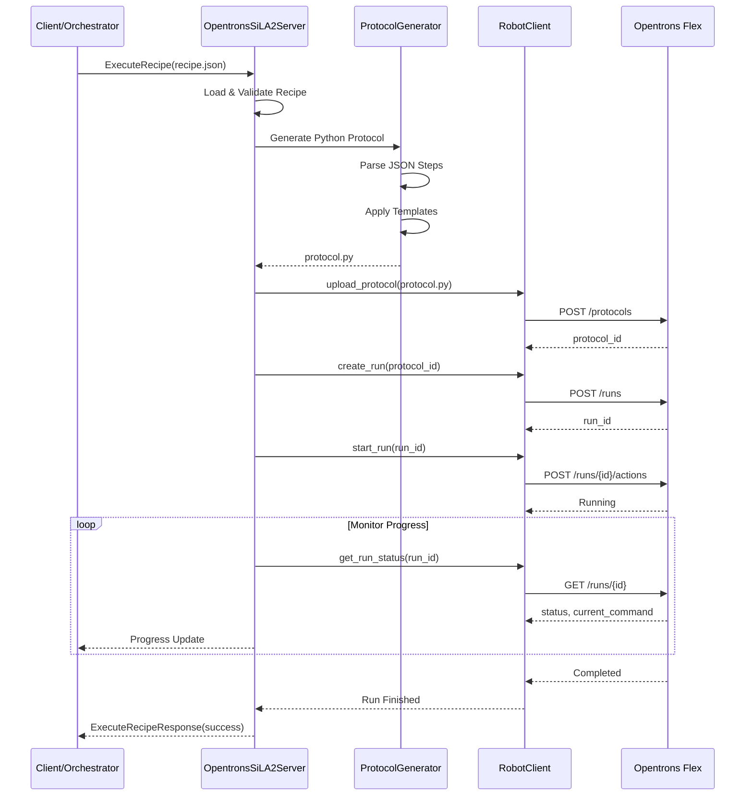

# 🤖 OpentronsSiLA2Server - Documentazione Dettagliata

> Server SiLA2 per il controllo del robot per liquid handling Opentrons Flex

## 📋 Informazioni Generali

| Proprietà | Valore |
|-----------|--------|
| **Linguaggio** | Python 3.10+ |
| **Protocollo** | SiLA2 (gRPC) |
| **Porta Default** | 50052 |
| **Strumento** | Opentrons Flex |
| **API Level** | 2.27 (latest) |

---

## 🏗️ Architettura del Server

```
┌─────────────────────────────────────────────────────────────────────┐
│                    OpentronsSiLA2Server                              │
├─────────────────────────────────────────────────────────────────────┤
│                                                                      │
│  ┌──────────────┐     ┌───────────────────────────────────────────┐ │
│  │   main.py    │────▶│         gRPC Async Server                 │ │
│  │  (Entrypoint)│     │  - OpentronsFlex Feature                  │ │
│  └──────────────┘     │  - LiquidHandling Feature                 │ │
│                       │  - ModuleControl Feature                   │ │
│                       └───────────────────────────────────────────┘ │
│                                      │                               │
│                                      ▼                               │
│  ┌─────────────────────────────────────────────────────────────────┐│
│  │                       server.py                                  ││
│  │   OpentronsSiLA2Server Class                                     ││
│  │   - initialize(): Setup components                               ││
│  │   - start(): Start gRPC server                                   ││
│  │   - execute_recipe(): Run JSON recipes                          ││
│  │   - process_directory(): Watch input folder                      ││
│  └─────────────────────────────────────────────────────────────────┘│
│                    │                    │                            │
│         ┌─────────┴─────────┬──────────┴─────────┐                  │
│         ▼                   ▼                    ▼                   │
│  ┌─────────────┐    ┌─────────────────┐   ┌─────────────────┐       │
│  │robot_client │    │protocol_generator│   │hardware_manager │       │
│  │    .py      │    │      .py        │   │      .py        │       │
│  │             │    │                 │   │                 │       │
│  │ HTTP REST   │    │ JSON → Python   │   │ HAL Configs     │       │
│  │ to Robot    │    │ Protocol Gen    │   │ Slot Mapping    │       │
│  └─────────────┘    └─────────────────┘   └─────────────────┘       │
│         │                   │                                        │
│         │                   │                                        │
│         ▼                   ▼                                        │
│  ┌─────────────┐    ┌─────────────────┐    ┌─────────────────┐      │
│  │ tip_tracker │    │    config.py    │    │     utils.py    │      │
│  │    .py      │    │                 │    │                 │      │
│  │             │    │ ServerConfig    │    │ Helper funcs    │      │
│  │ Tip State   │    │ Logging setup   │    │                 │      │
│  └─────────────┘    └─────────────────┘    └─────────────────┘      │
│                                                                      │
└─────────────────────────────────────────────────────────────────────┘
                              │
                              ▼ HTTP REST API
                    ┌─────────────────┐
                    │  Opentrons Flex │
                    │   Robot Server  │
                    │  (Port 31950)   │
                    └─────────────────┘
```

---

## 📁 Struttura File

```
OpentronsSiLA2Server/
├── src/
│   ├── __init__.py
│   ├── server.py           # Server principale SiLA2
│   ├── robot_client.py     # Client HTTP per Opentrons API
│   ├── protocol_generator.py  # Genera Python da JSON (60+ comandi)
│   ├── hardware_manager.py    # Hardware Abstraction Layer
│   ├── tip_tracker.py      # Tracciamento stato tip
│   ├── config.py           # Configurazione
│   └── utils.py            # Utility functions
├── protos/
│   └── opentrons.proto     # Definizioni Protocol Buffers
├── config/
│   └── server_config.yaml  # Configurazione server
├── README.md
└── requirements.txt
```

---

## 🔧 Configurazione

### server_config.yaml

```yaml
server:
  host: "0.0.0.0"
  port: 50052
  name: "OpentronsFlex"
  version: "2.0.0"

robot:
  ip: "192.168.1.100"  # IP del robot Opentrons
  port: 31950
  timeout: 30
  local_address: "192.168.1.50"  # IP locale per upload

directories:
  input: "../../Queue/pending_workflows"
  processed: "../../Queue/processed"
  errors: "../../Queue/errors"
  output: "../../Results/opentrons"
  images: "../../Results/opentrons/images"
  logs: "logs"
  temp: "temp"

hardware:
  config_folder: "../../Library/HardwareConfig"
  default_config: "Standard_Flex_Setup.json"

tip_tracking:
  enabled: true
  state_file: "tip_state.json"

connection:
  retry_count: 3
  retry_delay: 5
```

### Environment Variables

```bash
OPENTRONS_ROBOT_IP=192.168.1.100
OPENTRONS_SERVER_PORT=50052
OPENTRONS_LOG_LEVEL=INFO
```

---

## 🔌 Componenti Principali

### 1. RobotClient (robot_client.py)

Client HTTP asincrono per comunicare con l'Opentrons REST API.

```python
class RobotClient:
    """Client HTTP per Opentrons Flex Robot."""
    
    async def connect_with_retry(self, max_retries, retry_delay, on_retry):
        """Connetti con retry automatico."""
    
    async def get_health(self) -> dict:
        """Ottieni stato di salute del robot."""
    
    async def get_runs(self) -> list:
        """Lista delle esecuzioni."""
    
    async def create_run(self, protocol_id: str) -> str:
        """Crea nuova esecuzione."""
    
    async def upload_protocol(self, filepath: str) -> str:
        """Carica protocollo Python sul robot."""
    
    async def start_run(self, run_id: str) -> bool:
        """Avvia esecuzione."""
    
    async def pause_run(self, run_id: str) -> bool:
        """Pausa esecuzione."""
    
    async def resume_run(self, run_id: str) -> bool:
        """Riprendi esecuzione."""
    
    async def cancel_run(self, run_id: str) -> bool:
        """Annulla esecuzione."""
    
    async def home(self) -> bool:
        """Homing robot."""
```

### 2. ProtocolGenerator (protocol_generator.py)

Converte ricette JSON in protocolli Python eseguibili.

**Comandi Supportati (60+):**

#### Liquid Handling Base
- `Aspirate` - Aspira liquido
- `Dispense` - Dispensa liquido
- `Mix` - Miscela
- `BlowOut` - Svuota tip
- `TouchTip` - Tocca parete pozzetto
- `AirGap` - Aspira gap d'aria
- `Transfer` - Trasferimento completo

#### Gestione Tip
- `PickupTip` - Prendi tip
- `DropTip` - Rilascia tip
- `ReturnTip` - Ritorna tip in rack
- `ConfigureNozzleLayout` - Configura layout pipetta multi-canale

#### Movimento
- `MoveToWell` - Muovi a pozzetto
- `MoveLabware` - Sposta labware con gripper
- `MoveToCoordinates` - Muovi a coordinate
- `Home` - Homing assi

#### Moduli
- `HeaterShakerSetSpeed` / `HeaterShakerSetTemperature`
- `ThermocyclerSetBlockTemperature` / `ThermocyclerSetLidTemperature`
- `ThermocyclerRunProfile` - Esegui profilo PCR
- `TemperatureModuleSetTemperature`
- `MagneticModuleEngage` / `MagneticModuleDisengage`
- `AbsorbanceReaderRead`
- `FlexStackerRetrieve` / `FlexStackerStore`

#### Configurazione Avanzata
- `ConfigureForVolume` - Ottimizza per volume specifico
- `SetFlowRates` - Imposta velocità flusso
- `PrepareToAspirate` - Prepara pipetta
- `DefineLiquid` / `LoadLiquid` - Definisci liquidi

### 3. HardwareManager (hardware_manager.py)

Gestisce l'Hardware Abstraction Layer (HAL).

```python
class HardwareManager:
    """Gestisce configurazioni hardware e mapping slot."""
    
    def load_config(self, name: str) -> dict:
        """Carica configurazione hardware."""
    
    def get_slot_for_labware(self, labware_name: str) -> str:
        """Ottieni slot per labware."""
    
    def get_labware_definition(self, labware_name: str) -> dict:
        """Ottieni definizione labware."""
    
    def apply_hal_mapping(self, recipe: dict) -> dict:
        """Applica mapping HAL a ricetta."""
```

### 4. TipTracker (tip_tracker.py)

Traccia lo stato dei tip per recovery da crash.

```python
class TipTracker:
    """Traccia stato tip consumabili."""
    
    def mark_used(self, rack: str, well: str):
        """Segna tip come usato."""
    
    def get_next_tip(self, rack: str) -> str:
        """Ottieni prossimo tip disponibile."""
    
    def save_state(self):
        """Salva stato su disco."""
    
    def restore_state(self):
        """Ripristina stato da disco."""
    
    def reset_rack(self, rack: str):
        """Reset rack tip."""
```

---

## 📡 SiLA2 Features

### Feature: OpentronsFlex

| Comando | Descrizione |
|---------|-------------|
| `Connect` | Connetti al robot |
| `Disconnect` | Disconnetti |
| `GetHealth` | Stato di salute |
| `Home` | Homing robot |
| `GetRuns` | Lista esecuzioni |

### Feature: LiquidHandling

| Comando | Descrizione |
|---------|-------------|
| `ExecuteRecipe` | Esegui ricetta JSON |
| `ExecuteProtocol` | Esegui protocollo Python |
| `PauseRun` | Pausa esecuzione |
| `ResumeRun` | Riprendi esecuzione |
| `CancelRun` | Annulla esecuzione |

### Feature: ModuleControl

| Comando | Descrizione |
|---------|-------------|
| `GetModules` | Lista moduli connessi |
| `ControlHeaterShaker` | Controlla HeaterShaker |
| `ControlThermocycler` | Controlla Thermocycler |
| `ControlTemperatureModule` | Controlla Temperature Module |

---

## 📝 Formato Ricetta JSON

```json
{
  "ProtocolName": "My Protocol",
  "Author": "Lab User",
  "Description": "Protocol description",
  "APILevel": "2.27",
  
  "Modules": {
    "heater_shaker": {
      "Type": "heaterShakerModuleV1",
      "Slot": "D1"
    }
  },
  
  "Labware": {
    "source_plate": {
      "Type": "corning_96_wellplate_360ul_flat",
      "Slot": "C2"
    },
    "tiprack_1000": {
      "Type": "opentrons_flex_96_tiprack_1000ul",
      "Slot": "B2"
    }
  },
  
  "Trash": {
    "waste": {
      "Type": "TrashBin",
      "Slot": "A3"
    }
  },
  
  "Pipettes": {
    "left": "flex_1channel_1000"
  },
  
  "Steps": [
    {
      "Command": "Comment",
      "Text": "Starting protocol"
    },
    {
      "Command": "PickupTip",
      "PipetteMount": "left",
      "TipRack": "tiprack_1000"
    },
    {
      "Command": "Aspirate",
      "PipetteMount": "left",
      "Labware": "source_plate",
      "Well": "A1",
      "Volume": 100.0
    },
    {
      "Command": "Dispense",
      "PipetteMount": "left",
      "Labware": "source_plate",
      "Well": "B1",
      "Volume": 100.0
    },
    {
      "Command": "DropTip",
      "PipetteMount": "left"
    }
  ]
}
```

---

## 🔄 Flusso di Esecuzione



---

## 🛠️ Hardware Abstraction Layer (HAL)

### Configurazione HAL (Standard_Flex_Setup.json)

```json
{
  "name": "Standard_Flex_Setup",
  "description": "Standard Flex configuration",
  "deck": {
    "version": "flex",
    "slots": {
      "A1": null,
      "A2": null,
      "A3": "trash_bin",
      "B1": null,
      "B2": "tiprack_1000",
      "B3": "tiprack_200",
      "C1": "source_reservoir",
      "C2": "working_plate",
      "C3": null,
      "D1": "heater_shaker",
      "D2": "temperature_module",
      "D3": null
    }
  },
  "labware_definitions": {
    "working_plate": "corning_96_wellplate_360ul_flat",
    "source_reservoir": "nest_12_reservoir_15ml",
    "tiprack_1000": "opentrons_flex_96_tiprack_1000ul",
    "tiprack_200": "opentrons_flex_96_tiprack_200ul"
  },
  "pipettes": {
    "left": "flex_1channel_1000",
    "right": "flex_8channel_50"
  }
}
```

### Uso HAL nelle Ricette

Con HAL attivo, la ricetta può usare nomi logici:

```json
{
  "UseHAL": true,
  "HALConfig": "Standard_Flex_Setup",
  "Steps": [
    {
      "Command": "Aspirate",
      "PipetteMount": "left",
      "Labware": "working_plate",  // Nome logico
      "Well": "A1",
      "Volume": 100
    }
  ]
}
```

---

## 🔬 Moduli Supportati

### HeaterShaker Module V1

```json
{
  "Command": "HeaterShakerSetTemperature",
  "Module": "heater_shaker",
  "Temperature": 37.0
}
```

```json
{
  "Command": "HeaterShakerSetSpeed",
  "Module": "heater_shaker",
  "RPM": 500
}
```

### Thermocycler Module V2

```json
{
  "Command": "ThermocyclerRunProfile",
  "Module": "thermocycler",
  "Profile": [
    {"Temperature": 95.0, "HoldTime": 300, "Label": "Initial Denaturation"},
    {"Temperature": 95.0, "HoldTime": 30, "Label": "Denaturation"},
    {"Temperature": 55.0, "HoldTime": 30, "Label": "Annealing"},
    {"Temperature": 72.0, "HoldTime": 60, "Label": "Extension", "Cycles": 35}
  ]
}
```

### Temperature Module V2

```json
{
  "Command": "TemperatureModuleSetTemperature",
  "Module": "temp_module",
  "Temperature": 4.0
}
```

### Magnetic Module V2

```json
{
  "Command": "MagneticModuleEngage",
  "Module": "mag_module",
  "Height": 6.5
}
```

### Absorbance Plate Reader

```json
{
  "Command": "AbsorbanceReaderRead",
  "Module": "absorbance_reader",
  "Wavelengths": [450, 630],
  "ReferenceWavelength": 630,
  "OutputVariable": "abs_results"
}
```

### Flex Stacker

```json
{
  "Command": "FlexStackerRetrieve",
  "Module": "stacker",
  "TargetSlot": "C2"
}
```

---

## 🐛 Gestione Errori

### Errori Comuni

| Errore | Causa | Soluzione |
|--------|-------|-----------|
| `ConnectionError` | Robot non raggiungibile | Verifica IP e connessione rete |
| `ProtocolError` | Errore nel protocollo | Controlla sintassi JSON |
| `TipError` | Problema con tip | Verifica tiprack e posizione tip |
| `LabwareError` | Labware non trovato | Controlla definizione labware |
| `ModuleError` | Modulo non risponde | Verifica connessione modulo |

### Recovery da Crash

Il sistema include:
1. **Tip Tracking Persistente**: Stato tip salvato su disco
2. **Emergency Reset Protocol**: Protocollo per reset sicuro
3. **Run Recovery**: Possibilità di riprendere esecuzioni interrotte

```python
# Emergency reset
await server.execute_emergency_reset()

# Restore tip state
server.tip_tracker.restore_state()
```

---

## 📊 Logging

### Livelli di Log

```python
# config.py
LOG_LEVELS = {
    "DEBUG": 10,    # Dettagli sviluppo
    "INFO": 20,     # Operazioni normali
    "WARNING": 30,  # Situazioni anomale
    "ERROR": 40,    # Errori recuperabili
    "CRITICAL": 50  # Errori fatali
}
```

### Formato Log

```
2024-01-22 10:30:45.123 | INFO | server.py:152 | Starting protocol execution
2024-01-22 10:30:45.456 | DEBUG | robot_client.py:89 | POST /protocols response: 201
2024-01-22 10:30:46.789 | INFO | server.py:198 | Protocol uploaded: protocol_abc123
```

---

## 🚀 Avvio Server

### Modalità Standard
```bash
cd SiLA2/OpentronsSiLA2Server
python -m src
```

### Con Parametri
```bash
python -m src --port 50052 --robot-ip 192.168.1.100 --log-level DEBUG
```

### Modalità Simulazione
```bash
python -m src --simulate
```

---

## 🧪 Testing

### Test Connessione
```python
import asyncio
from src.robot_client import RobotClient

async def test():
    client = RobotClient(host="192.168.1.100", port=31950)
    health = await client.get_health()
    print(f"Robot: {health['name']}")
    print(f"API Version: {health['api_version']}")

asyncio.run(test())
```

### Test Esecuzione Ricetta
```python
from src.server import OpentronsSiLA2Server
from src.config import ServerConfig

async def test_recipe():
    config = ServerConfig()
    server = OpentronsSiLA2Server(config)
    await server.initialize()
    
    result = await server.execute_recipe("Library/Recipes/test_case1.json")
    print(f"Result: {result}")

asyncio.run(test_recipe())
```

---

## 📚 Riferimenti

- [Opentrons Python API Documentation](https://docs.opentrons.com/v2/)
- [Opentrons HTTP API](https://docs.opentrons.com/http-api/)
- [SiLA2 Standard](https://sila-standard.com/)
- [gRPC Python](https://grpc.io/docs/languages/python/)

---

*Documentazione OpentronsSiLA2Server - BicoccaLab v6*
