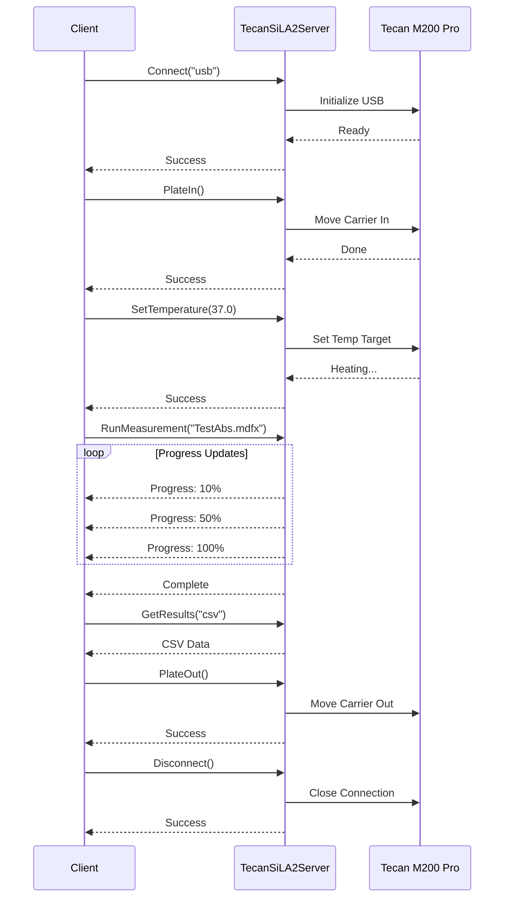

# 🔬 TecanSiLA2Server - Documentazione Dettagliata

> Server SiLA2 per il controllo del lettore di micropiastre Tecan M200 Pro

## 📋 Informazioni Generali

| Proprietà | Valore |
|-----------|--------|
| **Linguaggio** | C# / .NET 6+ |
| **Protocollo** | SiLA2 (gRPC) |
| **Porta Default** | 50051 |
| **Strumento** | Tecan M200 Pro / Infinite Series |
| **SDK** | Tecan iControl SDK |

---

## 🏗️ Architettura del Server

```
┌─────────────────────────────────────────────────────────────────┐
│                    TecanSiLA2Server                              │
├─────────────────────────────────────────────────────────────────┤
│                                                                  │
│  ┌──────────────┐     ┌──────────────────────────────────────┐  │
│  │  Program.cs  │────▶│        gRPC Server (Kestrel)         │  │
│  │  (Entrypoint)│     │   - PlateReaderService (SiLA2)       │  │
│  └──────────────┘     └──────────────────────────────────────┘  │
│                                    │                             │
│                                    ▼                             │
│  ┌──────────────────────────────────────────────────────────┐   │
│  │              PlateReaderServiceImpl.cs                    │   │
│  │   - Comandi: Connect, Disconnect, PlateIn, PlateOut      │   │
│  │   - Comandi: SetTemperature, RunMeasurement, GetResults  │   │
│  │   - Proprietà: IsConnected, OperationalStatus, Temp      │   │
│  └──────────────────────────────────────────────────────────┘   │
│                                    │                             │
│                                    ▼                             │
│  ┌──────────────────────────────────────────────────────────┐   │
│  │                    TecanBridge.cs                         │   │
│  │   - Wrapper per Tecan SDK (iControl)                     │   │
│  │   - Gestione connessione USB/Seriale                     │   │
│  │   - Esecuzione protocolli .mdfx                          │   │
│  │   - Parsing risultati                                     │   │
│  └──────────────────────────────────────────────────────────┘   │
│                                    │                             │
│                                    ▼                             │
│  ┌──────────────────────────────────────────────────────────┐   │
│  │                  ResultParser.cs                          │   │
│  │   - Conversione risultati → CSV, XML, AnIML              │   │
│  └──────────────────────────────────────────────────────────┘   │
│                                                                  │
└─────────────────────────────────────────────────────────────────┘
                              │
                              ▼
                    ┌─────────────────┐
                    │  Tecan M200 Pro │
                    │   (USB/RS232)   │
                    └─────────────────┘
```

---

## 📁 Struttura File

```
TecanSiLA2Server/
├── Program.cs                  # Entry point, configurazione Host
├── ServerConfiguration.cs      # Modello configurazione
├── appsettings.json           # Configurazione applicazione
├── Features/
│   ├── PlateReaderService.sila.xml    # Definizione SiLA2 Feature
│   └── PlateReaderServiceImpl.cs      # Implementazione comandi
├── Instrument/
│   ├── TecanBridge.cs         # Bridge verso Tecan SDK
│   └── ResultParser.cs        # Parser risultati misurazioni
├── AnIML/
│   └── AnIMLWriter.cs         # Generatore formato AnIML
├── Protos/
│   └── platereader.proto      # Definizioni Protocol Buffers
├── lib/
│   └── Tecan.*.dll            # DLL SDK Tecan iControl
└── TecanClient/               # Client di test
```

---

## 🔧 Configurazione

### appsettings.json

```json
{
  "ServerSettings": {
    "Port": 50051,
    "Host": "0.0.0.0",
    "ServerName": "TecanPlateReader",
    "Description": "Tecan M200 Pro Plate Reader SiLA2 Server"
  },
  "TecanSettings": {
    "ProtocolsPath": "../../Library/Analysis",
    "ResultsPath": "../../Results",
    "ConnectionTimeoutSeconds": 60,
    "DefaultConnectionMode": "usb"
  },
  "Logging": {
    "LogLevel": {
      "Default": "Information",
      "Grpc": "Warning"
    }
  }
}
```

### Modalità di Connessione

| Mode | Descrizione |
|------|-------------|
| `usb` | Connessione USB diretta (default, solo strumento reale) |
| `sim` | Simulatore software (per testing) |
| `dialog` | Mostra dialog di selezione strumento |
| `any` | Primo strumento disponibile (reale o simulatore) |

---

## 📡 SiLA2 Feature: PlateReaderService

### Proprietà (Observable)

| Proprietà | Tipo | Observable | Descrizione |
|-----------|------|------------|-------------|
| `IsConnected` | Boolean | ✅ | Stato connessione strumento |
| `OperationalStatus` | String | ✅ | Stato operativo (Idle, Running, Error) |
| `CurrentTemperature` | Real | ✅ | Temperatura attuale (°C) |
| `InstrumentInfo` | Struct | ❌ | Info strumento (SN, firmware, etc.) |

### Comandi

#### 🔌 Connect
Connette al lettore di micropiastre.

```protobuf
rpc Connect(ConnectRequest) returns (ConnectResponse);

message ConnectRequest {
  string connection_string = 1;  // "usb", "sim", "dialog", ""
}

message ConnectResponse {
  bool success = 1;
}
```

**Esempio Client Python:**
```python
import grpc
from PlateReaderService_pb2_grpc import PlateReaderServiceStub
from PlateReaderService_pb2 import ConnectRequest

channel = grpc.insecure_channel('localhost:50051')
stub = PlateReaderServiceStub(channel)

# Connetti a strumento USB reale
response = stub.Connect(ConnectRequest(connection_string="usb"))
print(f"Connected: {response.success}")
```

---

#### 🔌 Disconnect
Disconnette dallo strumento.

```protobuf
rpc Disconnect(DisconnectRequest) returns (DisconnectResponse);
```

---

#### 📥 PlateIn
Inserisce la piastra nel lettore (movimento cassetto).

```protobuf
rpc PlateIn(PlateInRequest) returns (PlateInResponse);

message PlateInResponse {
  bool success = 1;
}
```

**Precondizioni:**
- Strumento deve essere connesso
- Cassetto non deve essere già inserito

---

#### 📤 PlateOut
Espelle la piastra dal lettore.

```protobuf
rpc PlateOut(PlateOutRequest) returns (PlateOutResponse);
```

---

#### 🌡️ SetTemperature
Imposta la temperatura target.

```protobuf
rpc SetTemperature(SetTemperatureRequest) returns (SetTemperatureResponse);

message SetTemperatureRequest {
  double target_temperature = 1;  // Range: 4.0 - 45.0 °C
}
```

**Limiti:**
- Minimo: 4.0°C
- Massimo: 45.0°C
- Precisione: ±0.5°C

---

#### 📊 RunMeasurement
Esegue una misurazione/protocollo.

```protobuf
rpc RunMeasurement(RunMeasurementRequest) returns (stream RunMeasurementResponse);

message RunMeasurementRequest {
  string protocol_file = 1;      // Nome file .mdfx
  string plate_id = 2;           // ID piastra per tracciabilità
  bool wait_for_temperature = 3; // Attendi stabilizzazione temp
}

message RunMeasurementResponse {
  string status = 1;
  int32 progress = 2;      // 0-100%
  string message = 3;
  bool is_complete = 4;
}
```

**Streaming:** Questo comando usa gRPC server streaming per fornire aggiornamenti di progresso in tempo reale.

**Esempio:**
```python
request = RunMeasurementRequest(
    protocol_file="TestAbs.mdfx",
    plate_id="PLATE_001",
    wait_for_temperature=True
)

for response in stub.RunMeasurement(request):
    print(f"Progress: {response.progress}% - {response.message}")
    if response.is_complete:
        break
```

---

#### 📈 GetResults
Recupera i risultati dell'ultima misurazione.

```protobuf
rpc GetResults(GetResultsRequest) returns (GetResultsResponse);

message GetResultsRequest {
  string format = 1;  // "xml", "csv", "animl", "raw"
}

message GetResultsResponse {
  bytes data = 1;           // Contenuto file
  string content_type = 2;  // MIME type
  string filename = 3;      // Nome file suggerito
}
```

---

## 📊 Tipi di Misurazione Supportati

### 1. Assorbanza (ABS)
```
Protocolli: TestAbs.mdfx
Lunghezze d'onda: 230-1000 nm
Applicazioni: ELISA, Bradford, BCA
```

### 2. Fluorescenza (FI)
```
Protocolli: TestFluo.mdfx
Eccitazione: 230-850 nm
Emissione: 280-850 nm
Applicazioni: GFP, FITC, Hoechst
```

### 3. Luminescenza (LUM)
```
Protocolli: TestLumi.mdfx
Rilevazione: Flash/Glow
Applicazioni: Reporter assays, ATP
```

### 4. Letture Ibride
```
Protocolli: TestIbrido.mdfx
Combinazione di più tipi nella stessa piastra
```

---

## 📁 Formati Output

### 1. CSV (Comma-Separated Values)
```csv
Plate,Well,Value,Unit
PLATE_001,A1,0.523,OD
PLATE_001,A2,0.891,OD
...
```

### 2. XML (Tecan Native)
```xml
<?xml version="1.0"?>
<TecanResults>
  <Plate ID="PLATE_001">
    <Well Position="A1" Value="0.523" Unit="OD"/>
  </Plate>
</TecanResults>
```

### 3. AnIML (Analytical Information Markup Language)
Standard ASTM per dati analitici:
```xml
<?xml version="1.0"?>
<AnIML version="0.90">
  <SampleSet>
    <Sample sampleID="PLATE_001">
      <Result>
        <SeriesSet name="AbsorbanceData">
          <Series name="Well">A1</Series>
          <Series name="Value" unit="AU">0.523</Series>
        </SeriesSet>
      </Result>
    </Sample>
  </SampleSet>
</AnIML>
```

---

## 🔄 Flusso di Lavoro Tipico



---

## 🐛 Gestione Errori

### Errori SiLA2

| Codice gRPC | Errore SiLA2 | Descrizione |
|-------------|--------------|-------------|
| `FAILED_PRECONDITION` | `NotConnected` | Strumento non connesso |
| `INVALID_ARGUMENT` | `TemperatureOutOfRange` | Temperatura fuori range |
| `INTERNAL` | `ConnectionFailed` | Connessione fallita |
| `INTERNAL` | `MovementFailed` | Movimento piastra fallito |
| `INTERNAL` | `MeasurementFailed` | Misurazione fallita |

### Esempio Gestione Errori Client

```python
try:
    stub.Connect(ConnectRequest(connection_string="usb"))
except grpc.RpcError as e:
    if e.code() == grpc.StatusCode.INTERNAL:
        print(f"Connection failed: {e.details()}")
    elif e.code() == grpc.StatusCode.FAILED_PRECONDITION:
        print("Instrument not ready")
```

---

## 🔧 Diagnostica

### Tool di Diagnostica
```bash
cd TecanSiLA2Server/DiagnosticTool
dotnet run
```

Verifica:
- Connessione USB Tecan
- DLL SDK caricate
- Strumento rilevato

### Log
I log vengono scritti in:
- Console (stdout)
- File: `logs/tecan_server.log`

Livelli: `Trace`, `Debug`, `Information`, `Warning`, `Error`, `Critical`

---

## 📦 Dipendenze

### NuGet Packages
- `Grpc.AspNetCore` - Server gRPC
- `Google.Protobuf` - Serializzazione
- `Microsoft.Extensions.Hosting` - Host ASP.NET

### SDK Tecan (lib/)
- `Tecan.At.Common.dll`
- `Tecan.At.Instrument.Common.dll`
- `Tecan.At.Measurement.dll`
- `Tecan.At.XFluor.Core.dll`
- `Tecan.At.XFluor.Connect.dll`

⚠️ **Nota:** Le DLL Tecan richiedono licenza iControl valida.

---

## ⚠️ Note Tecniche SDK Tecan

### Threading e STA Apartment

Il Tecan SDK utilizza componenti COM che richiedono l'esecuzione in un thread con **Single-Threaded Apartment (STA)**. Il server crea automaticamente un thread STA dedicato per tutte le operazioni SDK.

```csharp
// Il thread di misurazione deve essere STA
measurementThread.SetApartmentState(ApartmentState.STA);
```

### Comportamento Blocking di _server.Run()

La chiamata `_server.Run(runGuid)` è **BLOCCANTE** - ritorna solo quando la misurazione è completata. Questo significa che:

1. Non è necessario un loop di polling per attendere il completamento
2. Il timeout della misurazione è gestito internamente dall'SDK
3. Dopo `Run()`, i file di risultato (XML, Excel) sono già stati generati

```csharp
// CORRETTO: Run() è bloccante
_server.Run(runGuid);  // Ritorna quando la misurazione è completa
// XML file già disponibile qui

// ERRATO: Non serve polling!
// while (!measurementComplete) { ... }  // NON NECESSARIO
```

### Generazione Output

L'SDK genera automaticamente i risultati durante `Run()`:
- **XML**: Generato dal `XmlOutput` configurato nel `MultipleOutput`
- **Excel**: Generato dall'`ExcelOutput` (richiede Excel installato)
- **AnIML**: Convertito post-elaborazione dal server SiLA2

---

## 🚀 Avvio Server

### Da Visual Studio
1. Apri `TecanSiLA2Server.csproj`
2. F5 per avviare in debug

### Da Command Line
```bash
cd SiLA2/TecanSiLA2Server
dotnet run
```

### Come Servizio Windows
```bash
dotnet publish -c Release -o publish
sc create TecanSiLA2 binPath="C:\path\to\TecanSiLA2Server.exe"
sc start TecanSiLA2
```

---

## 🧪 Testing

### Test Manuale con Client
```bash
cd TecanClient
dotnet run -- connect
dotnet run -- platein
dotnet run -- run TestAbs.mdfx
dotnet run -- results csv
dotnet run -- plateout
dotnet run -- disconnect
```

### Test con Python
```python
# test_tecan.py
import grpc
from PlateReaderService_pb2_grpc import PlateReaderServiceStub
from PlateReaderService_pb2 import *

def test_connection():
    channel = grpc.insecure_channel('localhost:50051')
    stub = PlateReaderServiceStub(channel)
    
    # Test connect
    resp = stub.Connect(ConnectRequest(connection_string="sim"))
    assert resp.success
    
    # Test status
    status = stub.GetOperationalStatus(GetOperationalStatusRequest())
    print(f"Status: {status.value}")
    
    # Disconnect
    stub.Disconnect(DisconnectRequest())

if __name__ == "__main__":
    test_connection()
```

---

## 📚 Riferimenti

- [SiLA2 Standard](https://sila-standard.com/)
- [Tecan iControl Documentation](https://lifesciences.tecan.com/)
- [gRPC C# Documentation](https://grpc.io/docs/languages/csharp/)
- [AnIML Standard](https://www.animl.org/)

---

*Documentazione TecanSiLA2Server - BicoccaLab v7*
